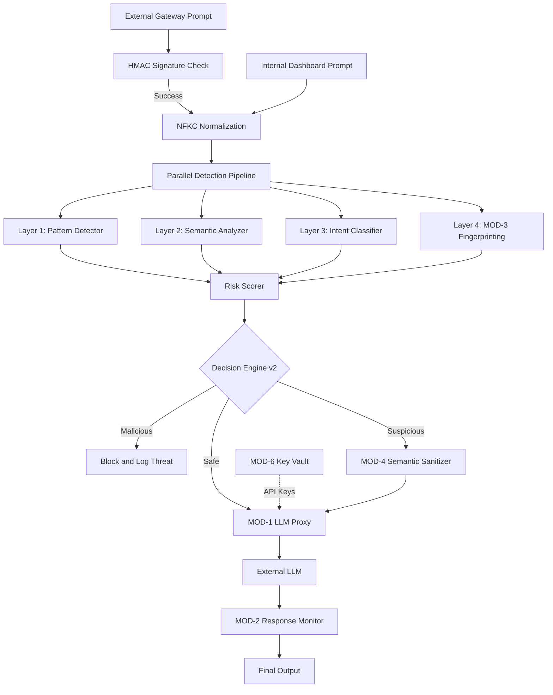

# 🏗️ IronGuard Architecture Overview

> IronGuard is a high-performance AI Security Gateway that implements a **v2 Hybrid Multi-Module Architecture** — combining parallel detection, semantic sanitization, and response monitoring to protect LLMs from adversarial attacks.

---

## 📦 System Components

### Security Modules (MODs)

<strong>MOD-1 — Real LLM Proxy Layer</strong>

- **File**: `app/proxy/llm_proxy.py`
- Routes requests to LLM providers (Gemini Flash primary, Mistral fallback)
- Handles security preamble injection and output sanitization

<strong>MOD-2 — Response Security Layer</strong>

- **File**: `app/response_security/`
- Scans LLM outputs for API keys, PII, and system prompt leakage
- Automatically redacts sensitive data while allowing educational examples

<strong>MOD-3 — Prompt Fingerprinting Engine</strong>

- **File**: `app/fingerprinting/`
- Uses **SimHash** and **MinHash LSH** for sub-millisecond detection of known jailbreaks
- Features an **Autonomous Learning** path that remembers new threats

<strong>MOD-4 — Semantic Sanitization Engine</strong>

- **File**: `app/sanitization/sanitizer.py`
- Neutralizes suspicious prompts (risk score 30–59) using optional LLM-based rewriting (Gemini Flash)
- Verifies **Intent Preservation** using embedding similarity (threshold: `0.50`)

<strong>MOD-5 — PII Redactor (Local / High-Speed)</strong>

- **File**: `app/sanitization/pii_redactor.py`
- **100% Local Regex/Rule-based** — detects and redacts emails, phone numbers, and names without any LLM calls
- **Learning Path Security** — used by MOD-3 to strip PII before storing threat signatures
- **Privacy Enforcement** — acts as a final "safety net" pass for all LLM-sanitized prompts

<strong>MOD-6 — Secure Key Vault (Keyless AI)</strong>

- **File**: `app/security_engine/key_vault.py`
- Securely stores and encrypts AI provider API keys using **AES-256 (Fernet)**
- Enables "Keyless AI" — the gateway handles credentials on behalf of employees

<strong>MOD-7 — Gateway Signature Layer (HMAC-SHA256)</strong>

- **Files**: `app/gateway/middleware.py`, `app/gateway/signing.py`
- Enforces cryptographic authentication for all `/gateway/v1/` requests
- Prevents spoofing and replay attacks using a deterministic canonical signing message

---

### Decision Engine v2

| Feature | Description |
|---------|-------------|
| **NFKC Normalization** | Flattens homoglyphs and hidden characters at ingress |
| **Hybrid Pipeline** | Runs Pattern Detection, Semantic Analysis, Intent Classification, and Fingerprinting **in parallel** |
| **Dynamic Risk Scoring** | Aggregates signals from all layers into a final score (0–100) |
| **Context Awareness** | Incorporates multi-turn conversation history into detection prompts |

### User Behavior Monitor

| Feature | Description |
|---------|-------------|
| **Trust Scoring** | Real-time reputation tracking based on prompt history |
| **Session Enforcement** | Automatically terminates sessions after 3+ high-risk attempts |

### Data Layer

| Store | Purpose |
|-------|---------|
| **MongoDB** | Persistent storage for security events, threat logs, user metadata, and encrypted provider keys |
| **ChromaDB** | High-speed vector search for semantic analysis and jailbreak fingerprinting |
| **Fingerprint DB** | Hot-reloading JSON store for autonomous threat signatures |

---

## 🔄 Data Flow Diagram

---

## 🛡️ Security Rationale: Defense in Depth

IronGuard's multi-module design ensures no single bypass defeats the system:

| Layer | Protection Provided |
|-------|---------------------|
| 🧬 **Fingerprinting** | Catches known attacks instantly — zero LLM cost |
| 🧠 **Intent Classification** | Catches novel attacks by understanding meaning |
| 🔒 **Local Sanitization** | Ensures data privacy (PII stripping) without external calls |
| ✏️ **Semantic Sanitization** | Neutralizes complex framing threats using intelligent rewrites |
| 📡 **Response Monitoring** | Prevents data leakage from the LLM itself |

---

<a href="../README.md">← Back to README</a>
