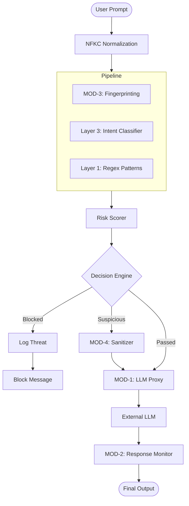

# IronGuard Architecture Overview

IronGuard is a high-performance AI Security Gateway designed to protect Large Language Models (LLMs) from adversarial attacks. It implements a v2 **Hybrid Multi-Module Architecture** that combines parallel detection, semantic sanitization, and response monitoring.

## System Components

### 1. Security Modules (MODs)
IronGuard is organized into four primary modules:

- **MOD-1: Real LLM Proxy Layer**
  - Managed by `app/proxy/llm_proxy.py`.
  - Routes requests to free LLM providers (**Gemini Flash** as primary, **Mistral** as fallback).
  - Handles security preamble injection and XML wrapping.
  - Implements per-user/provider rate limiting and exponential backoff.

- **MOD-2: Response Security Layer**
  - Managed by `app/response_security/`.
  - Scans LLM outputs for API keys, PII, and system prompt leakage.
  - Automatically redacts sensitive data while allowing educational examples.

- **MOD-3: Prompt Fingerprinting Engine**
  - Managed by `app/fingerprinting/`.
  - Uses **SimHash (XOR Hamming)** and **MinHash** for sub-millisecond detection of known jailbreak forms.
  - Integrates directly with the risk scorer to provide an immediate score bonus.

- **MOD-4: Semantic Sanitization Engine**
  - Managed by `app/sanitization/`.
  - Neutralizes suspicious prompts using a dual-path approach (Regex + LLM rewrite).
  - Verifies **Intent Preservation** using embedding similarity (threshold 0.50).

### 2. Decision Engine v2
- **NFKC Normalization**: Flattens homoglyphs and hidden characters at ingress.
- **Parallel Processing**: Uses `asyncio.gather` to run Fingerprinting and Intent Classification concurrently for low latency.
- **Risk Scoring**: Aggregates signals from all layers into a final score (0-100).

### 3. User Behavior Monitor & Identity Sync
- **Identity Sync**: Automatically synchronizes user names and emails from authentication providers.
- **Trust Scoring**: Tracks and enforces user trust scores over time.
- **Role-Based Access Control (RBAC)**: Distinguishes between Admin (analytics/management) and Employee (personal stats).

### 4. Data Layer
- **MongoDB**: Persistent storage for security events, threat logs, and user metadata.
- **ChromaDB**: High-speed vector search for semantic analysis and jailbreak fingerprinting.

## Data Flow Diagram

## Security Rationale: Defense in Depth
By combining these modules, IronGuard provides multiple layers of protection:
- **Fingerprinting** catches known attacks instantly.
- **Intent Classification** catches novel attacks by understanding meaning.
- **Sanitization** neutralizes threats without blocking legitimate work.
- **Response Monitoring** prevents data leakage from the LLM itself.

