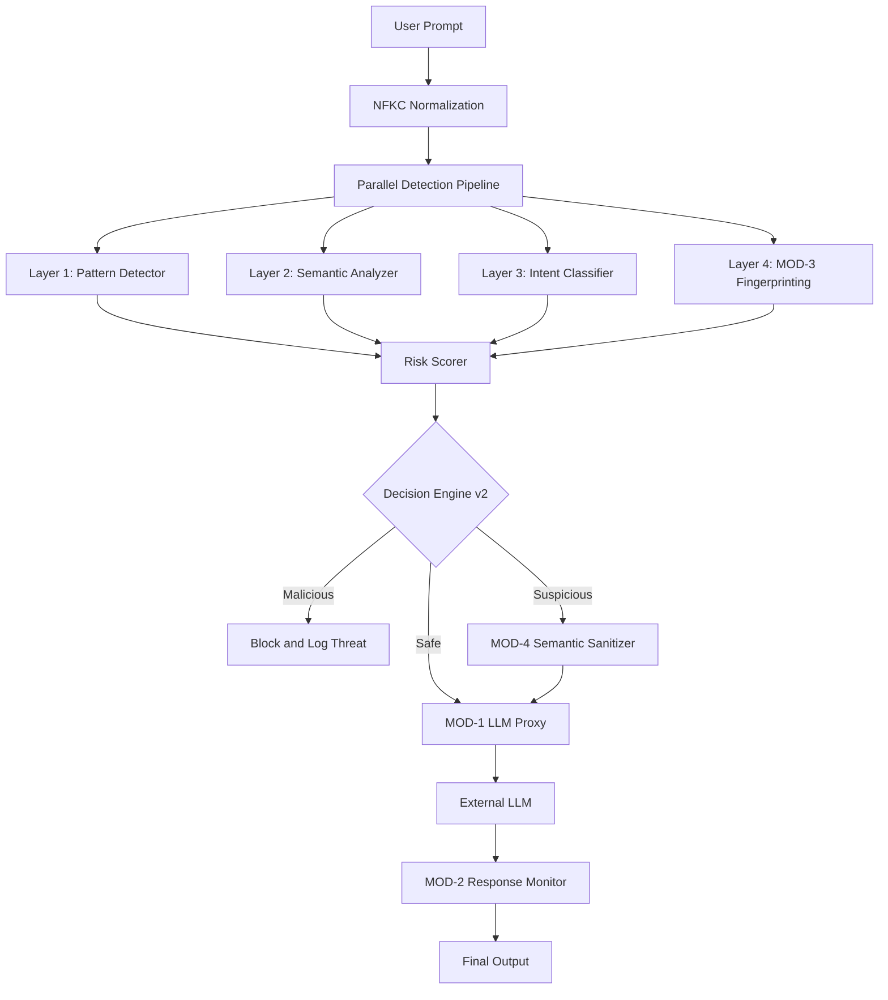

# IronGuard Architecture Overview

IronGuard is a high-performance AI Security Gateway designed to protect Large Language Models (LLMs) from adversarial attacks. It implements a v2 **Hybrid Multi-Module Architecture** that combines parallel detection, semantic sanitization, and response monitoring.

## System Components

### 1. Security Modules (MODs)
IronGuard is organized into four primary modules:

- **MOD-1: Real LLM Proxy Layer**
  - Managed by `app/proxy/llm_proxy.py`.
  - Routes requests to LLM providers (Gemini Flash primary, Mistral fallback).
  - Handles security preamble injection and output sanitization.

- **MOD-2: Response Security Layer**
  - Managed by `app/response_security/`.
  - Scans LLM outputs for API keys, PII, and system prompt leakage.
  - Automatically redacts sensitive data while allowing educational examples.

- **MOD-3: Prompt Fingerprinting Engine**
  - Managed by `app/fingerprinting/`.
  - Uses **SimHash** and **MinHash LSH** for sub-millisecond detection of known jailbreaks.
  - Features an **Autonomous Learning** path that remembers new threats.

- **MOD-4: Semantic Sanitization Engine**
  - Managed by `app/sanitization/`.
  - Neutralizes suspicious prompts using LLM-based rewriting.
  - Verifies **Intent Preservation** using embedding similarity (threshold 0.70).

### 2. Decision Engine v2
- **NFKC Normalization**: Flattens homoglyphs and hidden characters at ingress.
- **Hybrid Pipeline**: Runs Pattern Detection, Semantic Analysis, and Fingerprinting in parallel.
- **Context Awareness**: Incorporates multi-turn conversation history into detection prompts.

### 3. User Behavior Monitor
- **Trust Scoring**: Real-time reputation tracking based on prompt history.
- **Session Enforcement**: Automatically terminates sessions after 3+ high-risk attempts.

### 4. Data Layer
- **MongoDB**: Persistent storage for security events, threat logs, and user metadata.
- **ChromaDB**: High-speed vector search for semantic analysis and jailbreak fingerprinting.

## Data Flow Diagram

## Security Rationale: Defense in Depth
By combining these modules, IronGuard provides multiple layers of protection:
- **Fingerprinting** catches known attacks instantly.
- **Intent Classification** catches novel attacks by understanding meaning.
- **Sanitization** neutralizes threats without blocking legitimate work.
- **Response Monitoring** prevents data leakage from the LLM itself.

