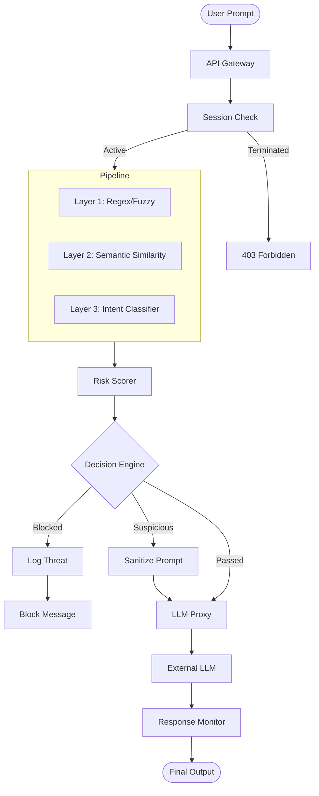

# IronGuard Architecture Overview

IronGuard is a high-performance, hybrid security middleware designed to protect Large Language Models (LLMs) from adversarial attacks. It implements a multi-layered detection pipeline that combines traditional rule-based methods with state-of-the-art AI models.

## System Components

### 1. Hybrid Detection Pipeline
The core of IronGuard is its 3-layer detection engine, which evaluates every incoming prompt before it reaches the LLM.

- **Layer 1: Pattern Detector (Regex & Fuzzy)**
  - Fast, deterministic detection of known attack signatures.
  - Uses `rapidfuzz` for error-tolerant matching (e.g., catching "sysem promt" or "instuction").
  - Handles multi-language injection strings.

- **Layer 2: Semantic Analyzer (ChromaDB)**
  - Compares the incoming prompt against thousands of known attack vectors.
  - Powered by a `SentenceTransformer` model (`all-MiniLM-L6-v2`).
  - Uses a vector database (ChromaDB) initialized with datasets like `advbench` and `hh-rlhf`.

- **Layer 3: Intent Classifier (Contextual AI)**
  - A dedicated deep learning model (`protectai/deberta-v3-base-prompt-injection-v2`) that understands the *intent* behind the prompt.
  - Can distinguish between a harmless story about hacking and a genuine request to generate malware.

### 2. Decision Engine & Risk Scorer
- Orchestrates the results from all detection layers.
- Calculates an aggregate **Risk Score** (0-100).
- Implements **Hard Blocks** for critical categories (Violence, Sexual Content, etc.).
- Decides on the final action: `Pass`, `Sanitize`, or `Block`.

### 3. User Behavior Monitor
- Tracks user trust scores over time.
- Automatically termintes sessions for users who repeatedly attempt malicious inputs.
- Provides an `/unblock` administrative capability.

### 4. Data Layer
- **MongoDB**: Stores security events, threat logs, and user trust scores.
- **ChromaDB**: Stores embeddings of known attack patterns for semantic comparison.

## Data Flow Diagram

## Security Rationale
By combining these layers, IronGuard addresses the weaknesses of single-method detection:
- **Regex** is fast but easily bypassed by slight variations.
- **Semantic search** catches variations but can be "diluted" by long, benign-looking text.
- **Intent classification** provides deep context but is computationally more expensive.

IronGuard runs them in parallel (or optimized sequence) to provide a "Defense in Depth" strategy.
